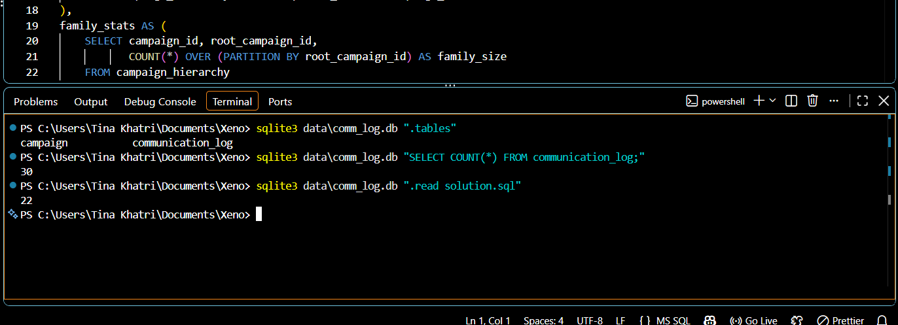

# Comm-Log Send Reconciliation — Submission

## Reconnaissance

I read the README and the assignment PDF. Three rules matter for what counts as a
qualifying send:

1. **Eligibility gate** — a campaign only counts once `creation_status` is finalized
   (approved/aborted/resumed/stopped) and `processing_status = 'processed'`.
   `approval_awaiting` campaigns don't count, even if sends already exist for them.
2. **Retry chains count once per customer** — `parent_id` links a campaign to the one
   it's retrying. A chain (A → B → C) is one underlying communication, re-attempted.
   A customer reached anywhere in that chain counts once, not once per attempt.
3. **Standalone campaigns don't dedupe** — a campaign with no parent and no retries
   pointing at it is independent. Every send under it counts, even if the same
   customer appears more than once.

## Naive baseline

```sql
SELECT COUNT(*)
FROM communication_log cl
JOIN campaign c ON cl.communication_id = c.id
WHERE cl.merchant_id = 501
  AND c.name LIKE '%Diwali%'
  AND cl.sent_time >= '2026-10-01 00:00:00'
  AND cl.sent_time < '2026-11-01 00:00:00';
```

Result: 30. Finance's target is 22 — an 8-row gap.

## Investigating the gap

Checked merchant scope and campaign names first — no issue, all 7 campaigns belong
to 501 and are Diwali campaigns. Checked `sent_time` vs `scheduled_time` — identical
across all rows, so no date issue either.

Campaign 9004 turned out to be `approval_awaiting`, even though it already has 4
log rows. Per the README, it doesn't count toward reporting yet. Excluding it:
30 → 26.

My first instinct after that was `COUNT(DISTINCT customer_id)`. That gave 21, not
22 — one short. Digging in, customer C20 appears twice under campaign 9101, a
standalone campaign with no retry chain. Those are two separate, legitimate sends,
not a retry — so they shouldn't be collapsed. Global distinct-customer counting
can't tell a retry-chain repeat from a standalone repeat, so it wrongly collapses
both. The fix isn't "dedupe everything" — it's dedupe only within retry chains,
and leave standalone campaigns alone.

I also considered just filtering to `delivery_status = 900` and counting rows,
which also gives 22 on this dataset. But it works here only because no customer in
either retry chain happens to have two delivered rows. If that ever happened (e.g.
a duplicate delivery confirmation), this filter would double-count them, while the
"one count per customer per chain" rule wouldn't. So I built the chain-aware
version below instead of relying on that coincidence.

## Grouping by retry chain

- **Chain 9001 → 9002 → 9003** (13 raw rows): C1 and C4–C10 delivered on the first
  try; C2 delivered on the retry; C3 delivered on the second retry. → 10 distinct
  customers reached.
- **Chain 9201 → 9202** (6 raw rows): D2–D5 delivered first try, D1 delivered on
  retry. → 5 distinct customers reached.
- **Standalone 9101** (7 raw rows, no chain): C20 (twice), C21–C25. No dedup — all
  7 count.

10 + 5 + 7 = 22.

## Reconciliation bridge

| Step | Description | Result | Delta | Reason |
|---|---|---|---|---|
| 0 | Naive count | 30 | — | Starting point |
| 1 | Exclude campaign 9004 (approval_awaiting) | 26 | -4 | Not finalized for reporting per README |
| 2 | Count once per customer within each retry chain | 22 | -4 | A chain is one communication, re-attempted — repeat attempts aren't separate sends |
| 3 | Confirm standalone campaign 9101 is *not* deduped | 22 | 0 | No chain = every send is its own event; global dedup would wrongly give 21 |
| final | | **22** | | Matches Finance's target_base |

## Final SQL

A recursive CTE is needed since chains can be more than one level deep, and the
counting rule (dedupe vs. no dedupe) depends on which family a campaign belongs to.

```sql
WITH RECURSIVE
eligible_campaigns AS (
    SELECT id, parent_id
    FROM campaign
    WHERE merchant_id = 501
      AND name LIKE '%Diwali%'
      AND creation_status IN ('approved', 'aborted', 'resumed', 'stopped')
      AND processing_status = 'processed'
),
campaign_hierarchy AS (
    SELECT id AS campaign_id, id AS root_campaign_id
    FROM eligible_campaigns
    WHERE parent_id IS NULL
    UNION ALL
    SELECT ec.id, ch.root_campaign_id
    FROM eligible_campaigns ec
    JOIN campaign_hierarchy ch ON ec.parent_id = ch.campaign_id
),
family_stats AS (
    SELECT campaign_id, root_campaign_id,
           COUNT(*) OVER (PARTITION BY root_campaign_id) AS family_size
    FROM campaign_hierarchy
),
qualifying_sends AS (
    SELECT cl.id, cl.customer_id, fs.root_campaign_id, fs.family_size
    FROM communication_log cl
    JOIN family_stats fs ON cl.communication_id = fs.campaign_id
    WHERE cl.merchant_id = 501
      AND cl.communication_type = '2'
      AND cl.delivery_status = 900
      AND cl.sent_time >= '2026-10-01 00:00:00'
      AND cl.sent_time <  '2026-11-01 00:00:00'
)
SELECT
    (SELECT COUNT(*) FROM (
        SELECT DISTINCT root_campaign_id, customer_id
        FROM qualifying_sends WHERE family_size > 1
    ))
    +
    (SELECT COUNT(*) FROM qualifying_sends WHERE family_size = 1)
    AS target_base;
```

Returns 22.

## What surprised me

The most interesting thing wasn't the final number — it's that two different
queries can both return 22 on this dataset for completely different reasons, and
only one of them is actually correct. A flat `delivery_status = 900` filter gets
the right number by accident here; it would break silently on a slightly different
dataset. I hadn't expected a 30-row toy dataset to hide that distinction so well.